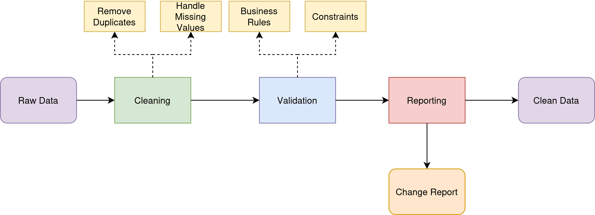

VLLM
1. **🧹 Clean separation of concerns** - main.py focuses on FastAPI app setup
2. **♻️ Reusable** - other parts of code can import vLLM functions
3. **🧪 Testable** - easier to unit test vLLM functions separately
4. **📖 Readable** - main.py stays focused and clean
5. **🔧 Maintainable** - vLLM logic is in one place

## 7. Start everything
Now you can start your application and it will:
1. **Automatically start vLLM server** with your Qwen model
2. **Wait for the server** to be ready
3. **Create the agent** with the vLLM model
4. **Run everything** in the E2B sandbox
``` bash
python main.py
```
The key changes:
- ✅ **vLLM serves your GGUF model** as OpenAI-compatible API
- ✅ **smolagents uses OpenAIModel** pointing to your local vLLM server
- ✅ **Automatic startup/shutdown** of vLLM server
- ✅ **All your parameters** (temperature, top_p, etc.) are preserved
