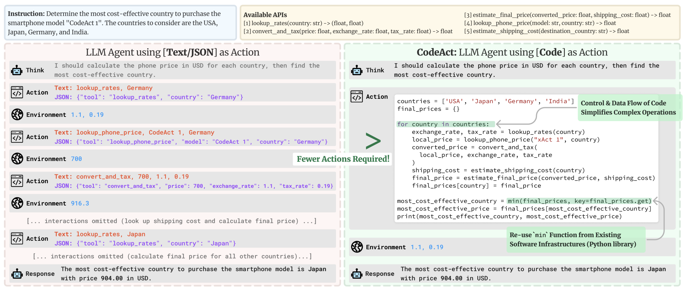

# Data Scientist CodeAgent
  
This repository demonstrates how to build a **data‑cleaning agent** on top of the [smolagents](https://huggingface.co/blog/smolagents) framework.  The agentic loop was initially designed to replicate the final project from my Data Analytics Masters course, but it proved so flexible and powerful that I now reuse the same code base for InfoSec and other side projects.  This README walks through the ideas behind smolagents, explains why *code agents* are powerful, documents the agentic loop used in this project and provides guidance on running it safely.  
## Why smolagents and code‑based actions?
  
  Traditional large language models (LLMs) are **passive** – they generate text, but they cannot decide which external tools to call or how to manipulate data.  AI agents close this gap by allowing an LLM to **act**: they can search the web, call APIs, execute code, and interact with databases [dev.to](https://dev.to/hayerhans/smolagents-the-simplest-way-to-build-powerful-ai-agents-18o#:~:text=Ever%20wonder%20how%20language%20models,language%20models%20and%20AI%20agents).  In smolagents the agent is decomposed into a *brain* (the LLM) and a *body* (a set of tool functions)[dev.to](https://dev.to/hayerhans/smolagents-the-simplest-way-to-build-powerful-ai-agents-18o#:~:text=As%20shown%20in%20the%20diagram,consists%20of%20two%20fundamental%20components).  The library is intentionally lightweight (~1,000 lines of code)[dev.to](https://dev.to/hayerhans/smolagents-the-simplest-way-to-build-powerful-ai-agents-18o#:~:text=smolagents%20brilliantly%20implements%20this%20architecture,agents%20shouldn%27t%20require%20complex%20architecture), focusing on a minimal API and ease of extension. That said it is in my humble opinion, by far the most powerful agentic framework since you can effectively have the AI build anything. Hugging Face provides various built in tools (Web Search etc) and you can imports 'Spaces' for deep research or whatever functionality you choose.  
  
  
<h2 align='center'>
  Most frameworks express actions as JSON blobs, but smolagents uses Python code as the action language. 
</h2>
<br><br>
<p align="center">
  
</p>

  Executing code rather than JSON provides several advantages: it allows you to compose actions naturally, reuse functions, store intermediate results and leverage the LLM's exposure to code in its training data[huggingface.co](https://huggingface.co/blog/smolagents#:~:text=Code%20agents).  In practice, generating code instead of structured JSON leads to more powerful and flexible agents[huggingface.co](https://huggingface.co/blog/smolagents#:~:text=Code%20agents).  The following comparison (from the research behind smolagents) illustrates the difference between JSON‑based and code‑based agents.  Code agents need fewer steps and can reuse existing Python constructs to reason about data and control flow:  
  
  Smolagents makes it simple to build such agents.  You create a model (e.g. a local LLM or one hosted via HuggingFace), define a few Python functions annotated with the `@tool` decorator, and pass them to a `CodeAgent`.  The agent will generate code at each step to solve the task, executing it in a sandboxed environment and using the tools when needed.  This **code‑first approach** is more natural for LLMs and more powerful for complex problems[dev.to](https://dev.to/hayerhans/smolagents-the-simplest-way-to-build-powerful-ai-agents-18o#:~:text=smolagents%20uses%20a%20code,it%20might%20generate%20code%20like).  
  
    
<h2 align='center'>
  The animated diagram below (extracted from HuggingFace’s launch post) gives an intuition for how the agentic loop in smolagents operates. :computer:
</h2>
<br><br>
<p align="center">
  
</p>


- ## Project overview
  
  The goal of this repository was to build a self‑contained *Data Scientist* agent that could revisit and improve my masters‑level data analytics project.  The agent processes sales and user‑feedback data for a fictional video‑game retailer called **Turtle Games**.  The original data science project focused on regression, clustering, support‑vector machines and other classic techniques; here the emphasis is on **cleaning**.  Once the agent runner was working I realised that the hardest part was dealing with messy data, and that the agentic loop (combined with smolagents) could automate much of this work.  I therefore pivoted the code to focus on data cleansing and have since reused the same framework for InfoSec research (e.g. profiling attackers with knowledge graphs).  
  
  The project loads two CSV files (`turtle_sales.csv` and `turtle_reviews.csv`) and cleans them in chunks.  The agent runs inside an [E2B sandbox](https://e2b.dev), which isolates code execution, and communicates with the user via a chat interface.  For reproducibility, the code has been tested on local GPUs ranging from an NVIDIA 4090 down to a 4070 Super using **Gemma 3‑12B** model.  Surprisingly, Gemma 3 (despite being marketed as a non‑reasoning model) performed better on the cleaning task than larger DeepSeek models.  The best performer overall was **Qwen 2.5**, but it is significantly larger and slower.  Because the agent runs arbitrary code, you should **never run it on your host machine** – always use a sandboxed NVMe drive within E2B. A 'Context-Window' refresher was added for the LLM, since without it the smaller LLM's will get very confused when they reach the limit.  
- ### Combining projects
  
  While this repository focuses on data cleaning, the agent runner can also be paired with my `[davidgnome](https://github.com/David-Barnes-Data-Imaginations/davidgnome_alpha)` project.  When combined, the agent gains access to a Linux command line and can perform tasks beyond Python execution.  I am also experimenting with an InfoSec variant where the agent constructs attacker personas using a knowledge graph, inspired by profiler **John Douglas**.  
- ## How the agentic loop works
- ### Modes
  
  The agent has two modes:  
- **Chat mode:** When you start `main.py`, the sandbox boots up, tools are loaded and metadata is embedded into a retrieval‑augmented generation (RAG) store.  The agent initially behaves like a normal chatbot – you can ask it general questions or query the data via the tools.
- **Agentic mode:** To enter agentic mode you issue a trigger command (omitted here for safety; please see the source if you need it).  The agent will switch to multi‑step operation, planning and executing actions until the task is complete.  You can type `stop` at any time to abort and return to chat mode.
- ### Planning and execution
  
  The loop itself is defined in `src/utils/prompts.py` and orchestrated in `src/client/agent.py`.  At each iteration the agent:  
- **Plans**: In *analysis mode* it summarises the task, gathers known facts and produces a structured plan.  It often uses a bullet‑point checklist and notes any assumptions.  For data cleaning the initial plan divides the work into *phases* (memory consultation, chunk analysis, strategy adaptation, cleaning execution and reflection).
- **Acts**: The agent then writes Python code to perform the next chunk of work.  The code may import pandas, load a subset of the CSV, compute statistics, visualise distributions, or call custom tools such as:
	- `SaveCleanedDataframe` – persists a cleaned chunk to disk;
	- `ValidateCleaningResults` – checks that a chunk meets schema and quality requirements;
	- `DocumentLearningInsights` – records observations and decisions in the RAG store;
	- `final_answer` – used once at the end to signal that all data has been cleaned.
- **Observes and learns**: After executing the code, the agent receives observations (e.g. a DataFrame head or summary statistics) and updates its plan accordingly.  It can adjust chunk size, change cleaning strategies (e.g. using interquartile range or Z‑score for outlier detection) and refine its expectations.
- **Repeats**: Steps 1–3 are repeated for each chunk of `turtle_sales` and then for `turtle_reviews`.  The agent stores insights in the RAG store so that later chunks can benefit from earlier discoveries.
  
  Because the agent writes Python code, it can reuse variables, define helper functions and loop over dataframes – this would be awkward in JSON.  The loop terminates when both datasets have been completely processed or when the user stops it.  
- ### User workflow
- Start the sandbox and run `main.py`.
- Wait while tools are loaded and metadata is embedded.
- Interact with the agent in chat mode.
- Trigger agentic mode to begin cleaning (see source for the exact command).  Optionally switch back to chat with `stop`.
- Allow the agent to plan and execute its multi‑step loop.  Progress is displayed both in the command line and in Gradio blocks.  Logs can also be sent to OpenTelemetry / Langfuse (disabled by default while debugging).
- When finished, retrieve the cleaned CSVs and review the documented insights.
- ### Example Run Snippet
  
 Demonstrating the phased approach, chunk processing and outlier removal:  
  
  ```
  ! Starting agentic workflow! I'm now in analysis mode.
  I can help you clean and analyse this data using a systematic, chunk‑based approach.
  I have access to the Turtle Games dataset with the following files:
  • Reviews CSV: /data/turtle_reviews.csv
  • Sales CSV: /data/turtle_sales.csv
  
  My cleaning workflow:
  1. Start with the first turtle_sales chunk of 200 rows.
  2. Clean the chunk.
  3. Validate the chunk using ValidateCleaningResults.
  4. Save the chunk using SaveCleanedDataframe (e.g. "cleaned_sales.csv").
  5. Record insights with DocumentLearningInsights.
  6. Repeat for the next chunk and then for turtle_reviews.
  7. Use final_answer once both tables are clean.
  
  **Memory Consultation Phase:**
  I checked for prior insights – none were found, so I'll begin exploratory analysis.
  
  **Chunk Analysis Phase:**
  Loaded the first 20 rows of `turtle_sales.csv` and inspected the columns: `Product`, `Ranking`, `Platform`, `Year`, `Genre`, `Publisher`, `NA_Sales`, `EU_Sales`, `Global_Sales`.  Data types were correct (numeric sales values) and there were no missing values.  Descriptive statistics indicated possible outliers.  A boxplot confirmed a few very high sales values.
  
  **Cleaning Execution:**
  Using the inter‑quartile range (IQR) method I calculated bounds for each sales column and filtered rows outside 1.5×IQR.  After saving the cleaned data I verified that the original dataset contained 352 rows and the cleaned dataset contained 322 rows.  A handful of extreme successes were removed:
  
  Product  Ranking Platform  Year Genre         Publisher   NA_Sales  EU_Sales  Global_Sales
    107        1      Wii  2006 Sports        Nintendo    34.02      23.80      67.85
    195        3      Wii  2008 Racing        Nintendo    13.00      10.56      29.37
    231        4      Wii  2009 Sports        Nintendo    12.92       9.03      27.06
    ... (additional outliers omitted)
  
  **Reflection:**
  Documented the cleaning strategy, noted that the IQR threshold was effective and planned to repeat the process for `turtle_reviews`.  Future iterations will incorporate data‑type validation for non‑numeric columns and automated summarisation of removed rows.
  ```
- ## Ethical considerations and safety
  
  Running a code agent gives the LLM a high degree of control over your environment.  Always remember that agents are experimental and should be treated accordingly.  In particular:  
- **Sandbox everything.**  The agent executes arbitrary code; only run it on a dedicated NVMe inside an [E2B](https://e2b.dev) sandbox or an equivalent container.  Never point it at your host operating system or personal files.
- **Keep secrets out of scope.**  Do not grant the agent access to sensitive credentials or systems.  Tools should be whitelisted explicitly.
- **Omit the trigger phrases for safety.**  Hugging Face intentionally does not publicise the exact commands that start multi‑step execution.  For similar reasons this README does not spell them out; you can find them in `src/client/agent.py` if you are comfortable reading the code.  This helps prevent inexperienced users from accidentally starting infinite‑running loops (or worse) on their parents’ PCs.
- **Logging and monitoring.**  The project previously used OpenTelemetry with Langfuse to record runs.  Logging is currently printed to the console and Gradio UI; re‑enable telemetry once you are comfortable with the behaviour.
  
I withhold some implementation details here so that potential employers can understand the design whilst still requiring users to examine the code as a safety measure.  A future version will provide a Gradio link to run the agent on my Website (under construction).  Feel free to reach out for a live demo.  
- ## Further work
- Re‑enable OpenTelemetry and Langfuse for full run tracing.
- Extend the agent with `[davidgnome](https://github.com/David-Barnes-Data-Imaginations/davidgnome_alpha)` integration for shell access and file operations.
- Improve the data‑cleaning heuristics (e.g. handling categorical typos, time series anomalies and missing data).
- Explore more compact models to run on low‑power devices; current candidates include Gemma 3‑12B (small but surprisingly effective) and Qwen 2.5 (larger but robust).
  
---
  
  By combining smolagents’ code‑first philosophy[huggingface.co](https://huggingface.co/blog/smolagents#:~:text=Code%20agents) with a carefully designed agentic loop, this project demonstrates that even complex data cleaning tasks can be automated safely.  I hope this repository provides useful insights and inspiration for building your own bespoke AI agents.  
-
